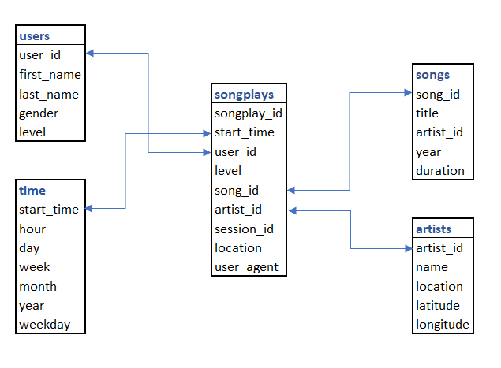

A startup called Sparkify wants to analyze the data they've been collecting on songs and user activity on their new music streaming app. The analytics team is particularly interested in understanding what songs users are listening to. Currently, they don't have an easy way to query their data, which resides in a directory of JSON logs on user activity on the app, as well as a directory with JSON metadata on the songs in their app.

This repository contains three Python scripts that initialize a Postgres database, create star-schema fact and dimension tables, and ETL the JSON files into these table.

A star-schema design will make analytical queries simple to write. It also allows for strong data integrity.

`sql_queries.py` contains the SQL to help us interact with the database. It includes `CREATE`, `DROP` and `INSERT` statements along with a couple helpful select queries. The `CREATE` and `INSERT` statements were created mindful of data integrity by including primary key constraints and handling conflicts.

`create_tables.py` initializes the database and executes `CREATE TABLE` commands to set the stage of `etl.py`

`etl.py` reads the "data" directory in the repository and iterates through the files within the "song_data" and "log_data" subdirectories. The script reads JSON files into pandas DataFrame objects, then inserts them into the database tables.

To execute the data pipeline, run the `create_tables.py` script followed by `etl.py`.

